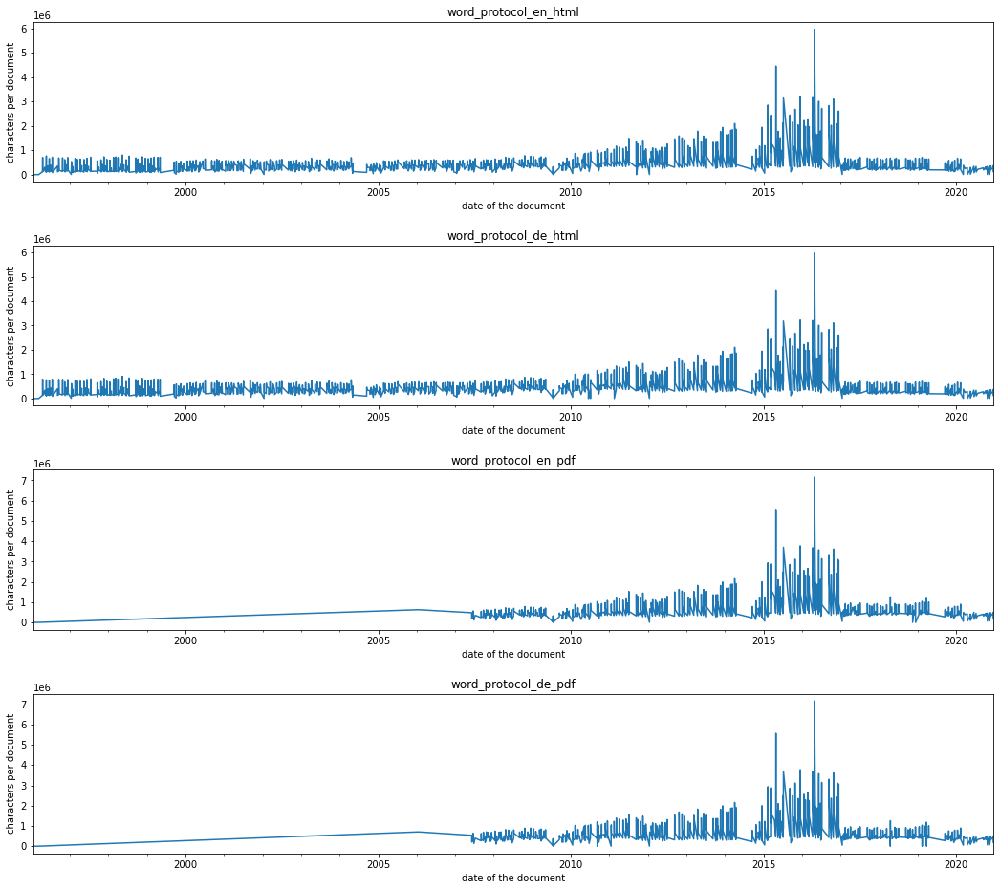
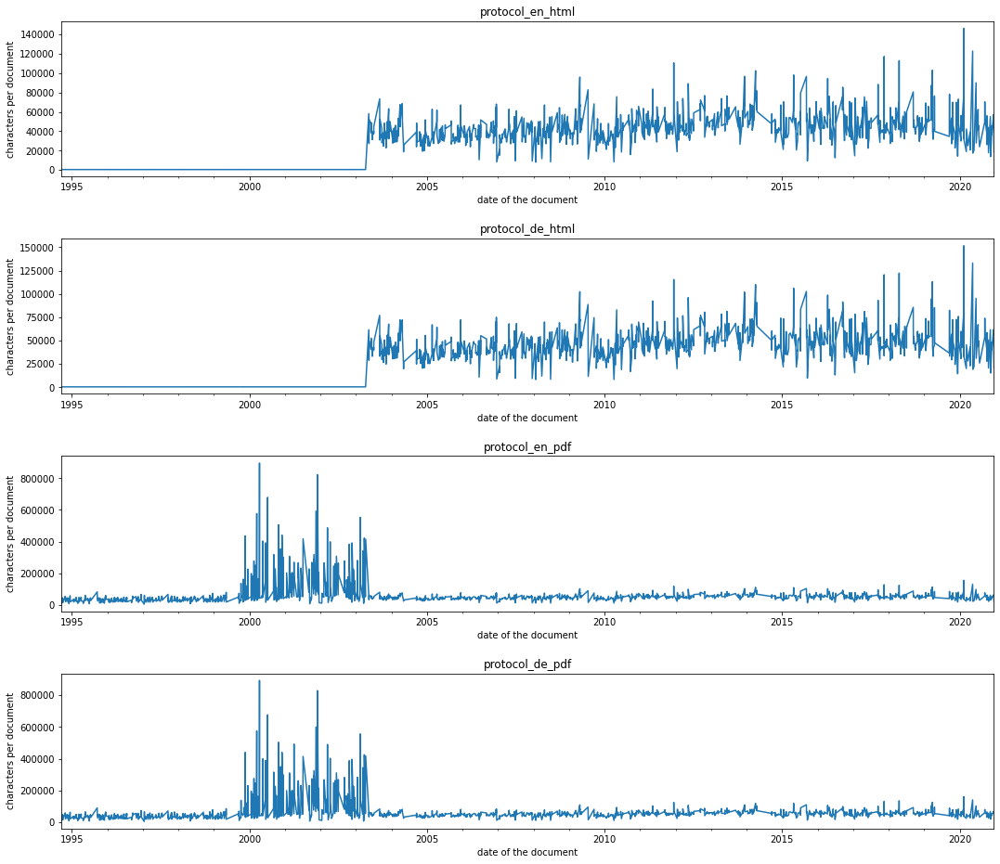

Datasources
===========

The European Union Parliament uses https://www.europarl.europa.eu/plenary/en/home.html to make documents available to members of the parliament and the public. It provides the UI and features like the search functionality. The documents themselves are hosted on https://www.europarl.europa.eu/doceo/document/ and are accessible via the links from the main site or enumeration. Enumerating these documents is aided by a common naming scheme.

+----------------+---------------------------+----------------------------------------------------------------------------+--------------------------------------------------------------------------------+---------------------------------------------------------------------------+--------------------------+-----------------------------------------------------------------------------------------------------+
| Type           | Subtype                   | Description                                                                | URL                                                                            | URL Structure                                                             | Filetypes                | Languages                                                                                           |
+----------------+---------------------------+----------------------------------------------------------------------------+--------------------------------------------------------------------------------+---------------------------------------------------------------------------+--------------------------+-----------------------------------------------------------------------------------------------------+
| Agenda         | Session Agenda            | Agenda overview of a complete session (multiple days)                      | https://www.europarl.europa.eu/doceo/document/OJ-9-2020-11-23-SYN_DE.html      | /OJ-{period}-{date of first session day}-SYN-{language}.{filetype}        | .html, .pdf              | BG, ES, CS, DA, DE, ET, EL, EN, FR, HR, IT, LV, LT, HU, MT, NL, PL, PT, RO, SK, SL, FI, SV          |
|                +---------------------------+----------------------------------------------------------------------------+--------------------------------------------------------------------------------+---------------------------------------------------------------------------+--------------------------+-----------------------------------------------------------------------------------------------------+
|                | Daily Agenda              | Detailed daily agenda including agenda items, speaking times and deadlines | https://www.europarl.europa.eu/doceo/document/OJQ-9-2020-11-23_DE.html         | /OJQ-{period}-{date}-{language}.{filetype}                                | .html, .pdf              | BG, ES, CS, DA, DE, ET, EL, EN, FR, HR, IT, LV, LT, HU, MT, NL, PL, PT, RO, SK, SL, FI, SV          |
+----------------+---------------------------+----------------------------------------------------------------------------+--------------------------------------------------------------------------------+---------------------------------------------------------------------------+--------------------------+-----------------------------------------------------------------------------------------------------+
| Voting Results | Summarized Voting Results | Summary of the voting results, referencing the votes document              | https://www.europarl.europa.eu/doceo/document/PV-9-2020-10-06-VOT_DE.pdf       | /PV-{period}-{date}-VOT_{langauge}.{filetype}                             | .html, .xml, .docx, .pdf | BG, ES, CS, DA, DE, ET, EL, EN, FR, HR, IT, LV, LT, HU, MT, NL, PL, PT, RO, SK, SL, FI, SV          |
|                +---------------------------+----------------------------------------------------------------------------+--------------------------------------------------------------------------------+---------------------------------------------------------------------------+--------------------------+-----------------------------------------------------------------------------------------------------+
|                | Voting protocol           | Named votes per voiting                                                    | https://www.europarl.europa.eu/doceo/document/PV-9-2020-10-06-RCV_DE.pdf       | /PV-{period}-{date}-VOT_{language}.{filetype}                             | .html, .docx             | BG, ES, CS, DA, DE, ET, EL, EN, FR, HR, IT, LV, LT, HU, MT, NL, PL, PT, RO, SK, SL, FI, SV          |
+----------------+---------------------------+----------------------------------------------------------------------------+--------------------------------------------------------------------------------+---------------------------------------------------------------------------+--------------------------+-----------------------------------------------------------------------------------------------------+
| Word Protocol  | Table of contents         | Table of contents of the verbatim record                                   | https://www.europarl.europa.eu/doceo/document/CRE-9-2020-07-09-TOC_DE.html     | /CRE-{period}-{date}-TOC_{language}.{filetype}                            | .html                    | BG, ES, CS, DA, DE, ET, EL, EN, FR, HR, IT, LV, LT, HU, MT, NL, PL, PT, RO, SK, SL, FI, SV          |
|                +---------------------------+----------------------------------------------------------------------------+--------------------------------------------------------------------------------+---------------------------------------------------------------------------+--------------------------+-----------------------------------------------------------------------------------------------------+
|                | Section                   | Verbatim record of an agenda section                                       | https://www.europarl.europa.eu/doceo/document/CRE-9-2020-07-09-ITM-001_DE.html | /CRE-{period}-{date}-ITM-{running number, 3 digits}_{language}.{filetype} | .html, .xml              | BG, ES, CS, DA, DE, ET, EL, EN, FR, HR, IT, LV, LT, HU, MT, NL, PL, PT, RO, SK, SL, FI, SV          |
|                +---------------------------+----------------------------------------------------------------------------+--------------------------------------------------------------------------------+---------------------------------------------------------------------------+--------------------------+-----------------------------------------------------------------------------------------------------+
|                | Complete protocol         | Verbatim record of the complete session                                    | https://www.europarl.europa.eu/doceo/document/CRE-9-2020-07-09_DE.html         | /CRE-{period}-{date}_{language}.{filetype}                                | .html, .xml, .pdf        | BG, ES, CS, DA, DE, ET, EL, EN, FR, HR, IT, LV, LT, HU, MT, NL, PL, PT, RO, SK, SL, FI, SV          |
|                |                           |                                                                            |                                                                                |                                                                           |                          | The protocol isn't translated but contains only the verbatim records in the language of the speaker |
+----------------+---------------------------+----------------------------------------------------------------------------+--------------------------------------------------------------------------------+---------------------------------------------------------------------------+--------------------------+-----------------------------------------------------------------------------------------------------+
| Protocol       | Attendance list           | Attendance list of all representative                                      | https://www.europarl.europa.eu/doceo/document/PV-9-2020-10-19-ATT_DE.html      | /PV-{period}-{date}-ATT_{language}.{filetype}                             | .html, .xml, .docx, .pdf | BG, ES, CS, DA, DE, ET, EL, EN, FR, HR, IT, LV, LT, HU, MT, NL, PL, PT, RO, SK, SL, FI, SV          |
|                +---------------------------+----------------------------------------------------------------------------+--------------------------------------------------------------------------------+---------------------------------------------------------------------------+--------------------------+-----------------------------------------------------------------------------------------------------+
|                | Table of contents         | Table of contents of the complete protocol                                 | https://www.europarl.europa.eu/doceo/document/PV-9-2020-10-19-TOC_DE.html      | /PV-{period}-{date}-TOC_{language}.{filetype}                             | .html                    | BG, ES, CS, DA, DE, ET, EL, EN, FR, HR, IT, LV, LT, HU, MT, NL, PL, PT, RO, SK, SL, FI, SV          |
|                +---------------------------+----------------------------------------------------------------------------+--------------------------------------------------------------------------------+---------------------------------------------------------------------------+--------------------------+-----------------------------------------------------------------------------------------------------+
|                | Complete Protocol         | Complete protocol                                                          | https://www.europarl.europa.eu/doceo/document/PV-9-2020-10-19_DE.html          | /PV-{period}-{date}_{language}.{filetype}                                 | .html, .xml, .docx, .pdf | BG, ES, CS, DA, DE, ET, EL, EN, FR, HR, IT, LV, LT, HU, MT, NL, PL, PT, RO, SK, SL, FI, SV          |
|                +---------------------------+----------------------------------------------------------------------------+--------------------------------------------------------------------------------+---------------------------------------------------------------------------+--------------------------+-----------------------------------------------------------------------------------------------------+
|                | Section                   | Section of the complete protocol                                           | https://www.europarl.europa.eu/doceo/document/PV-9-2020-10-19-ITM-006_DE.html  | /PV-{period}-{date}-ITM-{running number, 3 digits}_{language}.{filetype}  | .html, .xml              | BG, ES, CS, DA, DE, ET, EL, EN, FR, HR, IT, LV, LT, HU, MT, NL, PL, PT, RO, SK, SL, FI, SV          |
+----------------+---------------------------+----------------------------------------------------------------------------+--------------------------------------------------------------------------------+---------------------------------------------------------------------------+--------------------------+-----------------------------------------------------------------------------------------------------+
| '''Texts'''    | Tabled Texts              | Text entered for discussion and voting upon                                | https://www.europarl.europa.eu/doceo/document/A-9-2020-0181_EN.html            | /A-{period}-{year}-{running number, 4 digits}_{language}.{filetype}       | .html, .pdf, .word       | BG, ES, CS, DA, DE, ET, EL, EN, FR, HR, IT, LV, LT, HU, MT, NL, PL, PT, RO, SK, SL, FI, SV          |
|                +---------------------------+----------------------------------------------------------------------------+--------------------------------------------------------------------------------+---------------------------------------------------------------------------+--------------------------+-----------------------------------------------------------------------------------------------------+
|                | Accepted Texts TOC        | Overview over texts accepted in a session                                  | https://www.europarl.europa.eu/doceo/document/TA-9-2020-10-20-TOC_DE.html      | /TA-{period}-{date}-TOC_{language}.{filetype}                             | .html                    | BG, ES, CS, DA, DE, ET, EL, EN, FR, HR, IT, LV, LT, HU, MT, NL, PL, PT, RO, SK, SL, FI, SV          |
|                +---------------------------+----------------------------------------------------------------------------+--------------------------------------------------------------------------------+---------------------------------------------------------------------------+--------------------------+-----------------------------------------------------------------------------------------------------+
|                | Accepted Texts            | Accepted texts in their final form                                         | https://www.europarl.europa.eu/doceo/document/TA-9-2020-0272_DE.html           | /TA-{period}-{year}-{running number, 4 digits}-{language}.{filetype}      | .html, .pdf, .word       | BG, ES, CS, DA, DE, ET, EL, EN, FR, HR, IT, LV, LT, HU, MT, NL, PL, PT, RO, SK, SL, FI, SV          |
|                +---------------------------+----------------------------------------------------------------------------+--------------------------------------------------------------------------------+---------------------------------------------------------------------------+--------------------------+-----------------------------------------------------------------------------------------------------+
|                | All accepted texts        | All accepted Texts                                                         | https://www.europarl.europa.eu/doceo/document/TA-9-2020-10-20_DE.html          | /TA-{period}-{date}_{language}.{filetype}                                 | .html                    | BG, ES, CS, DA, DE, ET, EL, EN, FR, HR, IT, LV, LT, HU, MT, NL, PL, PT, RO, SK, SL, FI, SV          |
+----------------+---------------------------+----------------------------------------------------------------------------+--------------------------------------------------------------------------------+---------------------------------------------------------------------------+--------------------------+-----------------------------------------------------------------------------------------------------+

All URLs to these documents can be derived directly from the session date. The exception to this is the text document type. Their reliance on a running number makes special handling necessary.

Not all documents are available over the complete time. These plots show the contained content of the downloaded files.

Word protocol size over time, depending on file type.

Protocol size over time, depending on file type.