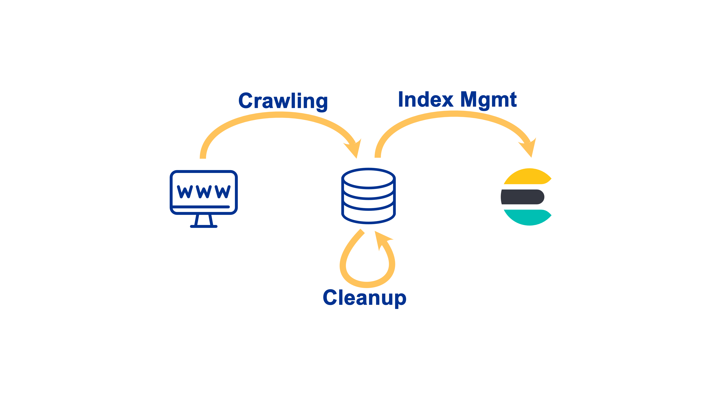

Overview
========

Tasks
-----

The main tasks for this practical are:

Develop document data and metadata model
Implement the models in Elasticsearch
Implement an active Crawler or an RSS feed based data retrieval method
This should be implemented using Python and Elasticsearch

Design goals
------------

The main design-goals for this crawler are:

**Niceness**
   We want to crawl responsibly -- a central crawling quota is necessary
**Interruptability**
   A restarted crawler should start where it left of -- the state must be stored in a durable way or should be easily restorable
**Resiliency**
   The crawler will be blocked, networks will fail, the crawler shouldn't crash -- retry and backup logic should be included
**Adaptabilty**
   The crawled sites will change, it is cruicial to notice breaking changes and adapt to them -- Failures should be logged and manually retryable
**Ease of use**
   Runtime dependencies should be reduced to a minimum -- no Docker, no Redis, Python, Postgres and a Filesystem should be enough
**Concurrency**
   Crawling is a io-heavy workload -- core tasks of the crawler should run in simultaniously, slow tasks should be parallelized

Architecture
------------

The application to download, post-process and index all documents is split into three steps, which can be run independently from each other in parallel or sequence.

The application is written in Python, makes heavy use of multiprocessing, can be configured via a configuration file, and provides a small CLI-Application for managing its operation.

It is structured into three jobs, crawling, postprocessing, and indexing, which employ multiple workers to achieve their goals. Each worker and job is a separate process. Workers in a common job can communicate directly with each other by using a message queue or signals. No direct communication between jobs is possible. The state is only communicated via the database. The management of the processes is based upon an existing library https://github.com/PamelaM/mptools which was vendored into the repository to make necessary upgrades to the logging and configuration options.

Simplified overview over the three steps of the application.

Computation results are stored in one of three persistence mechanisms

- PostgreSQL - stores application state and extracted data
- Filesystem - downloaded documents are stored in a folder on the filesystem
- Elasticsearch - index for the postprocessing results

All state stored in PostgreSQL is meant to be permanent and represents the tangible progress of working through the assigned task. The exception to this rule are "lock-bits", which signal that a database entry has already been queued up for computation in the message queue. But the processes responsible for these values are also responsible for cleaning up during shutdown and during startup. This approach makes it possible to interrupt and restart all jobs without incurring a too large overhead or losing a lot of work.

Additionally, it adds the benefit that the application is entirely data-driven. For example, marking a file as not post-processed will queue it up automatically, which will trigger a reindexing of the file as well.