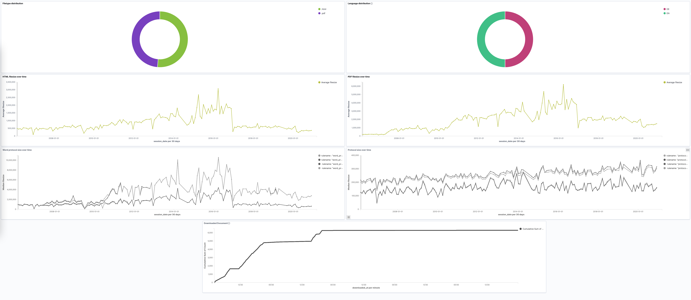

Production Setup
================

Then add these three `systemd` services to your setup. Replacing the `[...]` in the templates with path to the interpreter with the installed europarl project. Logs are then available via `journalctl`.
The services are meant to restart every 24 hours. Test runs didn't produced any errors caused by long running processes, but restarts don't hurt the progress made.

Crawler
^^^^^^^

.. code-block:: python

   [Unit]
   Description=Crawler
   After=network.target
   StartLimitIntervalSec=0

   [Service]
   Type=simple
   Restart=always
   RuntimeMaxSec=86400
   RestartSec=1
   User=europarl
   ExecStart=[...]/python3.9 eurocli crawler start

   [Install]
   WantedBy=multi-user.target

Postprocessor
^^^^^^^^^^^^^

.. code-block:: python

   [Unit]
   Description=Postprocessor
   After=network.target
   StartLimitIntervalSec=0

   [Service]
   Type=simple
   Restart=always
   RuntimeMaxSec=86400
   RestartSec=1
   User=europarl
   ExecStart=[...]/python3.9 eurocli postprocessing start

   [Install]
   WantedBy=multi-user.target

Indexer
^^^^^^^

.. code-block:: python

   [Unit]
   Description=Indexer
   After=network.target
   StartLimitIntervalSec=0

   [Service]
   Type=simple
   Restart=always
   RuntimeMaxSec=86400
   RestartSec=1
   User=europarl
   ExecStart=[...]/python3.9 eurocli indexing start

   [Install]
   WantedBy=multi-user.target

Kibana
^^^^^^

Load the export.ndjson file into Kibana to create the necessary objects for the dashboard.

Configuration
=============

The application can be configured via a settings.ini file. It contains all settings that are used per application module.

.. code-block:: python

   [DEFAULT]
   # Loglevel
   LogLevel=INFO

   # Sleeptime before a worker calls its main function again
   DefaultPollingTimeout=0.1

   # Database Connection Settings
   DBName=europarl
   DBUser=postgres
   DBPassword=
   DBHost=localhost
   DBPort=5432

   # Amount of entries the batch processing worker should preload
   PrefetchLimit = 5

   # Amount of seconds to wait on the cleanup jobs before killing the process
   StopWaitSecs=10

   [General]
   # Loglevel
   # LogLevel=INFO

   [TokenBucketWorker]
   # Loglevel
   # LogLevel=INFO

   # Minimal interval between token generation in seconds
   MinIntervalSecs = 3

   # ThrottlingFactor x IntervalSecs = Time to wait before making the next throttling check
   ThrottlingFactor = 10

   [SessionDayChecker]
   # Loglevel
   # LogLevel=INFO

   # Amount of entries the batch processing worker should preload
   # PrefetchLimit = 5

   [DateUrlGenerator]
   # Loglevel
   # LogLevel=INFO

   # Amount of entries the batch processing worker should preload
   # PrefetchLimit = 5

   [Downloader]
   # Loglevel
   # LogLevel=INFO

   # Amount of Worker Instances
   Instances=1
   # Directory where documents are stored
   Path=/Volumes/Backup/data/

   # Amount of seconds to wait on the cleanup jobs before killing the process
   #StopWaitSecs=10

   # RequestTimeoutFactor x StopWaitSeconds = Amount of seconds until a request is classified as a timeout
   RequestTimeoutFactor = 0.75

   [PostProcessingScheduler]
   # Loglevel
   # LogLevel=INFO

   # Amount of entries the batch processing worker should preload
   # PrefetchLimit = 5

   [PostProcessingWorker]
   # Loglevel
   # LogLevel=INFO

   # Amount of Worker Instances
   Instances=6

   [Indexer]
   # Loglevel
   # LogLevel=INFO

   # Amount of entries the batch processing worker should preload
   # PrefetchLimit = 5

   # Elasticsearch Settings
   ESConnection=localhost:9200
   ESIndexname=europarl

   [Test]
   # Database Connection Settings for tests
   # DBName=europarl
   # DBUser=postgres
   # DBPassword=
   # DBHost=localhost
   # DBPort=5432

   # Elasticsearch Settings for tests
   # ESConnection=localhost:9200
   # ESIndexname=europarl

Defaults can be overidden by a custom configuration file stored in "/etc/europarl/settings.ini".

The configuration module leverages the [https://docs.python.org/3/library/configparser.html Python configparser] module and its default value functionality. Therefore all values in the DEFAULT section of the configuration file are used in the other sections where these values are not entered.

