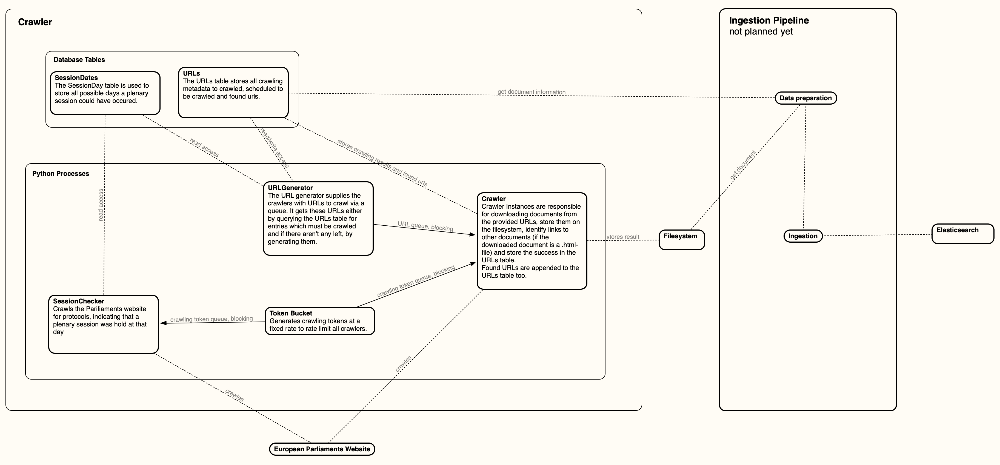

Welcome to europarl's documentation!
====================================

.. toctree::
   :maxdepth: 2

   code/processes
   code/database
   general/datasources

The main design-goals for this crawler are:

**Niceness**
   We want to crawl responsibly -- a central crawling quota is necessary
**Interruptability**
   A restarted crawler should start where it left of -- the state must be stored in a durable way or should be easily restorable
**Resiliency**
   The crawler will be blocked, networks will fail, the crawler shouldn't crash -- retry and backup logic should be included
**Adaptabilty**
   The crawled sites will change, it is cruicial to notice breaking changes and adapt to them -- Failures should be logged and manually retryable
**Ease of use**
   Runtime dependencies should be reduced to a minimum -- no Docker, no Redis, Python, Postgres and a Filesystem should be enough
**Concurrency**
   Crawling is a io-heavy workload -- core tasks of the crawler should run in simultaniously, slow tasks should be parallelized

Overview
--------

.. include:: code/processes.rst
.. include:: code/database.rst

Indices and tables
==================

* :ref:`genindex`
* :ref:`modindex`
* :ref:`search`
