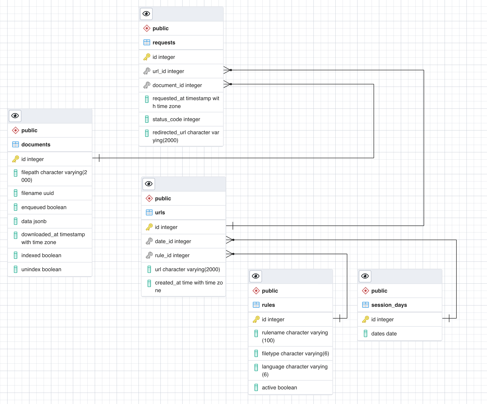

europarl.db package
===================

The europarl.db package is responsible for managing the lifecycle of database tables, the database connections and providing interfaces to the data.

The database consists out of a table for

- documents
- requests
- URLs
- rules
- session days

Entity relation diagram of the europarl database.

europarl.db.interface module
----------------------------

.. automodule:: europarl.db.interface
   :members:
   :undoc-members:
   :show-inheritance:

europarl.db.tables module
-------------------------

.. automodule:: europarl.db.tables
   :members:
   :undoc-members:
   :show-inheritance:

europarl.db.documents module
----------------------------

.. automodule:: europarl.db.documents
   :members:
   :undoc-members:
   :show-inheritance:

europarl.db.requests module
---------------------------

.. automodule:: europarl.db.requests
   :members:
   :undoc-members:
   :show-inheritance:

europarl.db.rules module
------------------------

.. automodule:: europarl.db.rules
   :members:
   :undoc-members:
   :show-inheritance:

europarl.db.sessionDay module
-----------------------------

.. automodule:: europarl.db.sessionDay
   :members:
   :undoc-members:
   :show-inheritance:

europarl.db.url module
----------------------

.. automodule:: europarl.db.url
   :members:
   :undoc-members:
   :show-inheritance:

