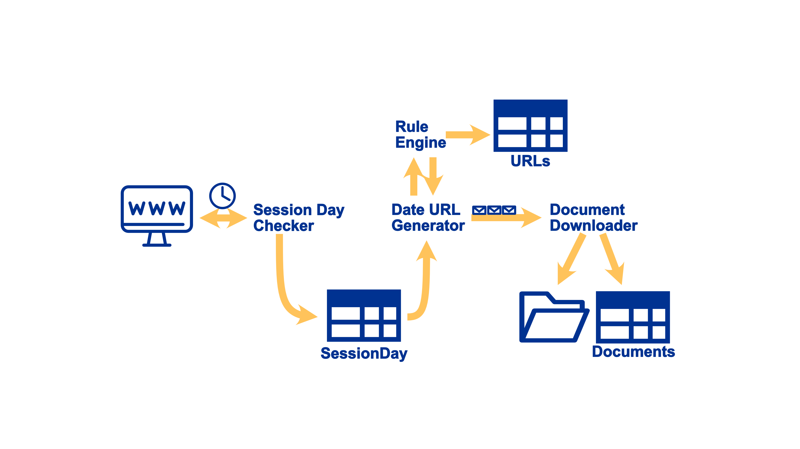
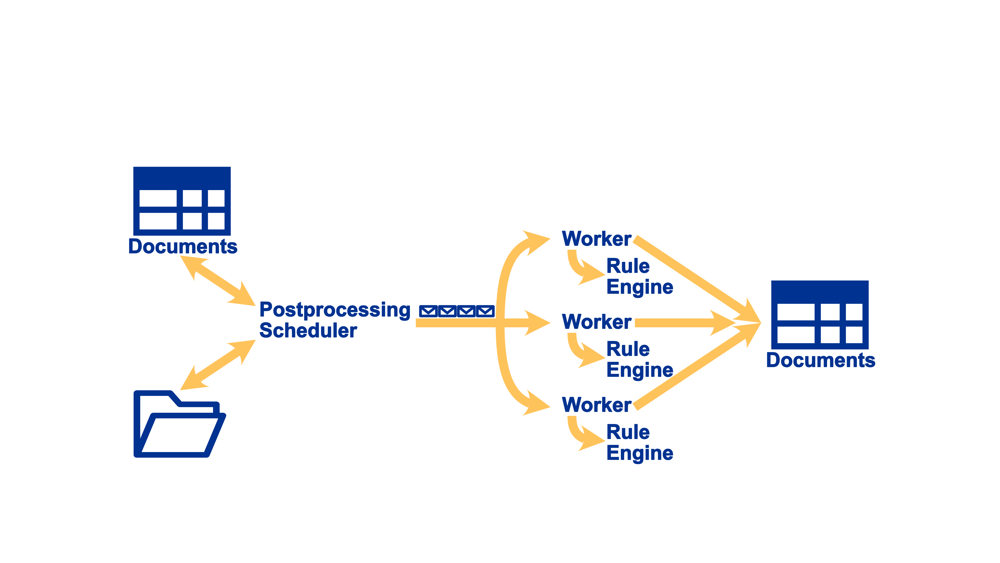
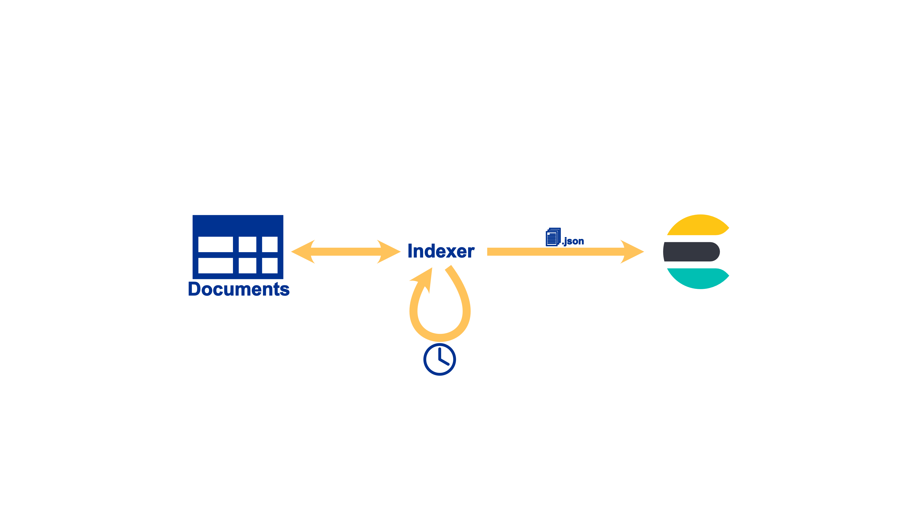

europarl.jobs package
=====================

europarl.jobs.crawler module
----------------------------

The crawler-job is responsible for

- identifying all session days
- deriving the URLs according to the rules
- downloading and cataloging the documents
- maintaining a nice crawling speed

.. automodule:: europarl.jobs.crawler
   :members:
   :undoc-members:
   :show-inheritance:

europarl.jobs.postprocessor module
----------------------------------

The postprocessing-job is responsible for applying all matching postprocessing rules to the document and storing the resulting data in the database.

A scheduler job queues up unprocessed documents which are consumed by instances of the postprocessing worker. It applies the matching rules to the file to extract the documents data and combines it with the metadata gathered during the crawling process and stores the results in a PostgreSQL .json column.

.. automodule:: europarl.jobs.postprocessor
   :members:
   :undoc-members:
   :show-inheritance:

europarl.jobs.indexer module
----------------------------

The indexing-job is responsible for storing all post-processed documents in Elasticsearch and removing obsolete documents. It loads a default mapping into Elasticsearch if there isn't already an index defined.

It then iterates over all currently not indexed documents and bulk loads these JSON-documents. This is done in a separate step from postprocessing to allow for incremental evolution of the mapping without requiring to reprocess all documents and makes the Elasticsearch instance ephemeral not needing backups as all data can be reloaded from the database.

The repository contains an export.ndjson-file which contains all the Kibana Settings to reproduce the dashboard.

.. automodule:: europarl.jobs.indexer
   :members:
   :undoc-members:
   :show-inheritance:

